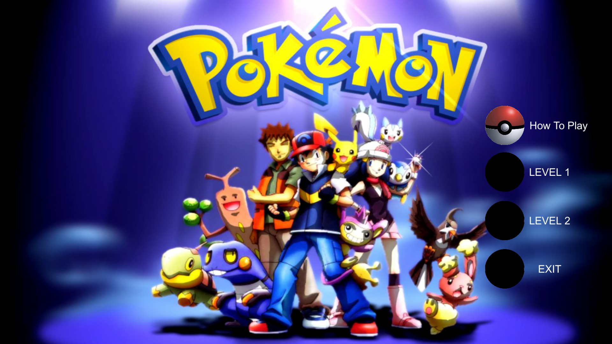
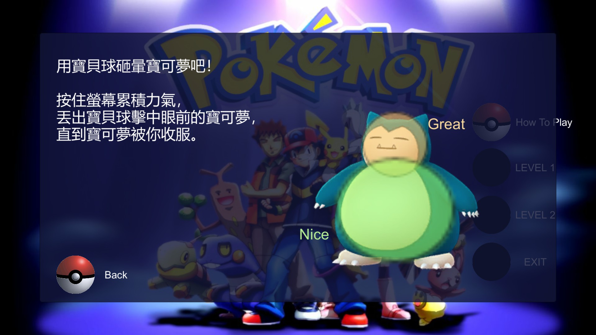
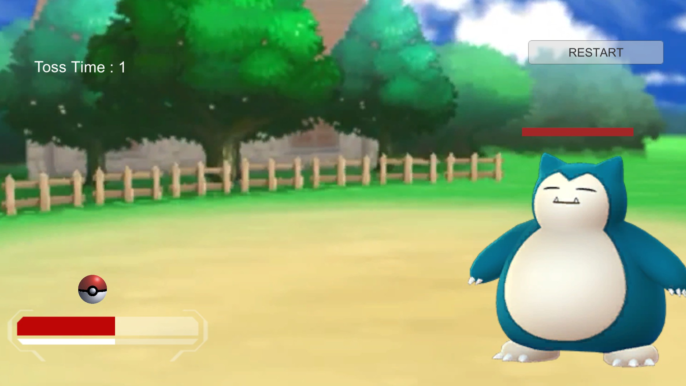
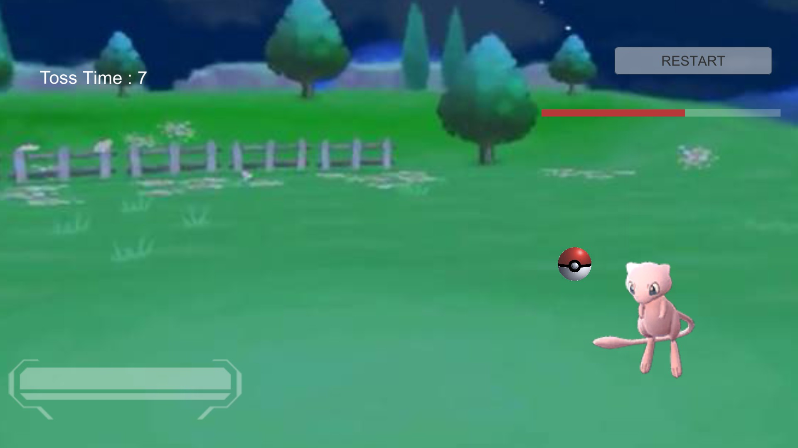
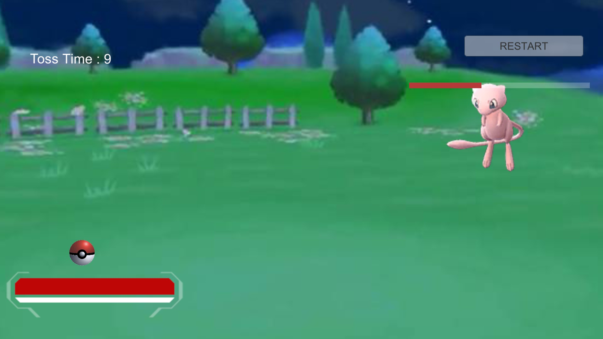
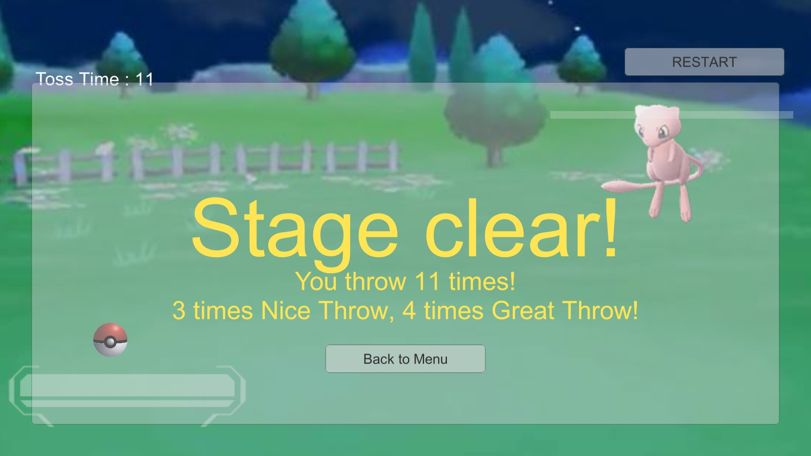

# 2DPokemon_Go 

### Introduction to Game Programming (by professor Hung-Kuo Chu)
##### A game designed by Unity2D.

## Introduction
#### It's a simple version of Pokemon Go!

## How to Play
#### Use mouse to aim the Pokemon and click to shoot the Pokeball.

#### Download whole hw3_exe folder to play the game!

